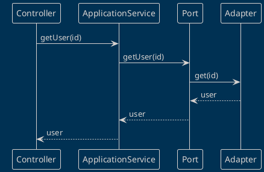
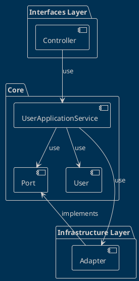

# Hexagonal Architecture Example in TypeScript

This README provides a detailed walkthrough of a TypeScript codebase demonstrating the principles of Hexagonal Architecture. A brainchild of Alistair Cockburn, Hexagonal Architecture emphasizes the separation of concerns in the system by isolating the central application from external services and actors such as user interfaces, databases, etc. This isolation is achieved through the definition of clear contracts or "ports" between the application and its external actors.

## Table of Contents

- [Hexagonal Architecture Example in TypeScript](#hexagonal-architecture-example-in-typescript)
  - [Table of Contents](#table-of-contents)
  - [Introduction](#introduction)
  - [Requirements and Installation](#requirements-and-installation)
  - [Running the Example](#running-the-example)
  - [Process Overview](#process-overview)
  - [Architecture Overview](#architecture-overview)
  - [Folder Structure Enhanced with Codes](#folder-structure-enhanced-with-codes)
    - [Core Layer](#core-layer)
      - [User Entity](#user-entity)
      - [Port](#port)
    - [Application Layer](#application-layer)
      - [User Application Service](#user-application-service)
    - [Infrastructure Layer](#infrastructure-layer)
      - [Adapter Implementation](#adapter-implementation)
    - [Interfaces Layer](#interfaces-layer)
      - [REST Controller](#rest-controller)
  - [Conclusion](#conclusion)

## Introduction

Hexagonal Architecture, often also called Ports and Adapters design pattern, prioritizes the isolation of the application's core logic from the outer world of databases, user interfaces, and other external services. This design pattern achieves such isolation by defining clear boundaries in the form of "ports", creating a clear separation of concerns.

Applying Hexagonal Architecture effectively leads to a codebase with improved maintainability and adaptability. It protects the business logic, the soul of your application, from getting influenced or changed by infrastructure considerations, ensuring the robustness, and long-term validity of the software system.

## Requirements and Installation

This example requires Node.js and TypeScript to be installed on your machine. To install the dependencies, simply run:

```sh
npm install
```

## Running the Example

To run the example, compile the TypeScript code and execute the resulting JavaScript using Node.js, like so:

```sh
tsc && node main.js
```

## Process Overview

Let's conceptualize a standard User service where a client can create and fetch User details:



1. A client makes a request through the Controller (interface layer).
2. The Controller interacts with the Application Service (core layer), transferring the command to fetch or store User data.
3. The Application Service uses the declared ports to achieve these tasks.
4. The Adapters in place connect the ports with respective databases or external environments, storing or fetching User data as required.

## Architecture Overview

This Hexagonal Architecture comprises three main layers:

1. **Core/Application Layer**: This layer hosts the business logic with domain entities and ports as intermediaries to interact with the outer world. It's the heart of your application where pure business rules apply.

2. **Infrastructure Layer**: This layer provides concrete implementations of the ports known as Adapters connecting to external services like databases or network interfaces, hence forming the outer edge of the hexagon.

3. **Interfaces Layer**: This is the layer that bridges user inputs to trigger the use cases inside the application/core layer.

Each of these components contributes to the insulation of the application's core, ensuring the business logic remains uninterrupted by external technical influences.

Here's a diagram illustrating the dependencies between the layers:



## Folder Structure Enhanced with Codes

The project follows an organized structure, with directories for each layer containing the respective elements:

```plaintext
my-project/
├── domain/
│   ├── entities/
│   │   └── user.ts
│   └── ports/
│       └── user.port.ts
├── application/
│   └── user-application.service.ts
├── infrastructure/
│   └── adapters/
│   │    └── user.adapter-impl.ts
│   └── contollers/
│       └── user.controller.ts
└── main.ts
```

- `domain`: This core layer contains the business logic with domain entities and ports.
- `application`: Contains the application services which use entities and ports.
- `infrastructure`: Contains the concrete implementations (adapters) which connect the external world to our application.
- `interfaces`: Contains the controllers that handle the user's interaction with the system.

### Core Layer

#### User Entity

The user domain entity encapsulates the business logic associated with the "User". 

```typescript
// user.ts
class User {
  constructor(public id: string, public username: string, public password: string) {}

  // other business rules and behavior methods go here
}

```

#### Port

Ports define an API to be implemented by adapters. Below is an example of a UserPort that provides methods for retrieving and storing User entities.

```typescript
// user.port.ts
interface UserPort {
  getById(id: string): User;
  add(user: User): void;
}
```

### Application Layer

#### User Application Service

The UserApplicationService coordinates tasks using the domain services through the ports.

```typescript
// user-application.service.ts
class UserApplicationService {
  private userPort: UserPort;
  
  constructor(userPort: UserPort) {
    this.userPort = userPort;
  }

  getUser(id: string): User {
    return this.userPort.getById(id);
  }

  createUser(user: User): void {
    this.userPort.add(user);
  }
}
```

### Infrastructure Layer

#### Adapter Implementation

Here's a concrete implementation of the UserPort acting as an Adapter, connecting the port with an InMemoryDatabase.

```typescript
// user.adapter-impl.ts
class UserAdapterImpl implements UserPort {
  private database: InMemoryDatabase<User>;

  constructor() {
    this.database = new InMemoryDatabase<User>();
  }

  getById(id: string): User {
    return this.database.getById(id);
  }

  add(user: User): void {
    this.database.add(user);
  }
}
```

### Interfaces Layer

#### REST Controller

The REST Controller handles HTTP requests, collects input from users, and sends responses, triggering commands in the application layer.

```typescript
// user.controller.ts
class UserController {
  private userApplicationService: UserApplicationService;

  constructor(userApplicationService: UserApplicationService) {
    this.userApplicationService = userApplicationService;
  }

  getUser(req: Request, res: Response): void {
    //...
  }

  createUser(req: Request, res: Response): void {
    //...
  }
}
```

## Conclusion

This TypeScript example illustrates Hexagonal Architecture principles by structuring the code into distinct layers, isolating business logic from external factors using ports, and linking these ports with specific technologies through adapters. The outcome is a codebase with improved maintainability and flexibility, advantageous for modern, complex systems.